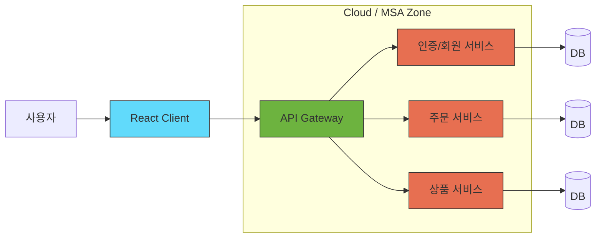

---
{"dg-publish":true,"permalink":"/einz-notes//"}
---

# 기술 스택 및 도구

EINZ의 주요 프로젝트에서 사용되는 핵심 기술과 개발 도구를 안내합니다.
현재 진행 중인 대형 커머스 프로젝트들은 최신 트렌드인 MSA(Microservices Architecture) 기반으로 구축되어 있습니다.

---

## 핵심 기술 스택

현재 **신세계라이브쇼핑**과 **LFmall** 프로젝트 모두 아래의 스택을 기반으로 운영되고 있습니다.

### 1. Frontend
* **React**: 사용자 인터페이스(UI) 구축을 위한 메인 라이브러리입니다.
* **Redux / Recoil**: 전역 상태 관리에 사용합니다. (프로젝트별 상이할 수 있음)
* **TypeScript**: 정적 타입 문법을 사용하여 코드의 안정성을 높입니다.

### 2. Backend
* **Java (JDK 17+)**: 주력 개발 언어입니다.
* **Spring Boot**: 마이크로서비스 구축을 위한 핵심 프레임워크입니다.
* **Spring Cloud**: MSA 환경에서의 라우팅(Gateway), 로드 밸런싱, 설정 관리 등을 담당합니다.

### 3. Architecture & Infrastructure
* **MSA (Microservices Architecture)**: 거대한 모놀리식 서비스가 아닌, 기능별로 독립된 서비스(상품, 주문, 회원 등)로 나누어 개발합니다.
* **Cloud**: 모든 서비스는 클라우드 환경(AWS/Azure/NCP 등)에 배포 및 운영됩니다.
* **Docker & Kubernetes**: 컨테이너화 및 오케스트레이션을 통해 배포를 관리합니다.

## 권장 개발 도구

원활한 업무 수행을 위해 아래 도구들의 설치를 권장합니다.

### IDE (통합 개발 환경)
- **IntelliJ IDEA** (Ultimate 권장): Java/Spring Boot 백엔드 개발 표준
- **VS Code**: React 프론트엔드 개발 및 가벼운 코드 편집

### 협업
- **Git**: 형상 관리 (Gitlab/Github)
- **JIRA**: 이슈 트래킹 및 프로젝트 관리
- **Confluence / Notion**: 문서화 및 위키

### Database & API
- **DBeaver**: 통합 DB 클라이언트 툴
- **Postman**: API 테스트 및 문서화

---

## 주요 프로젝트별 현황

|**프로젝트명**|**상태**|**주요 특징**|
|---|---|---|
|**신세계라이브쇼핑**|`On-Going`|Cloud Native, 대규모 트래픽 처리 중점|
|**LFmall**|`On-Going`|MSA 전환 및 고도화 작업 진행 중|

---
Last Updated: 2026-02-02